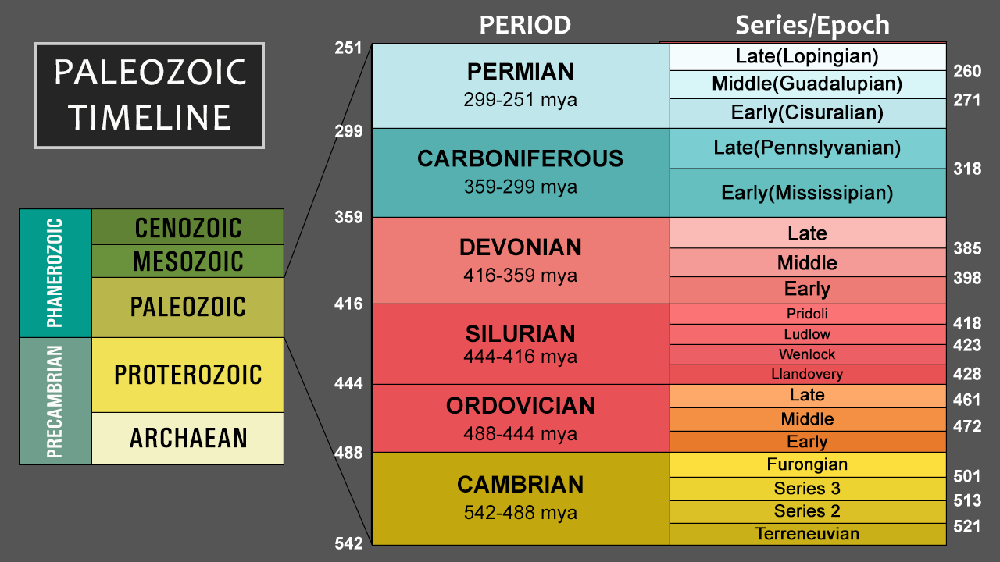
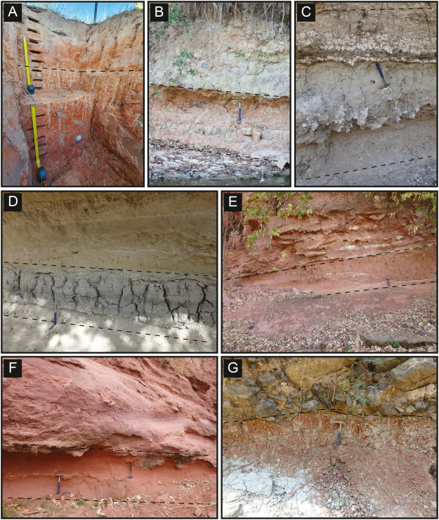
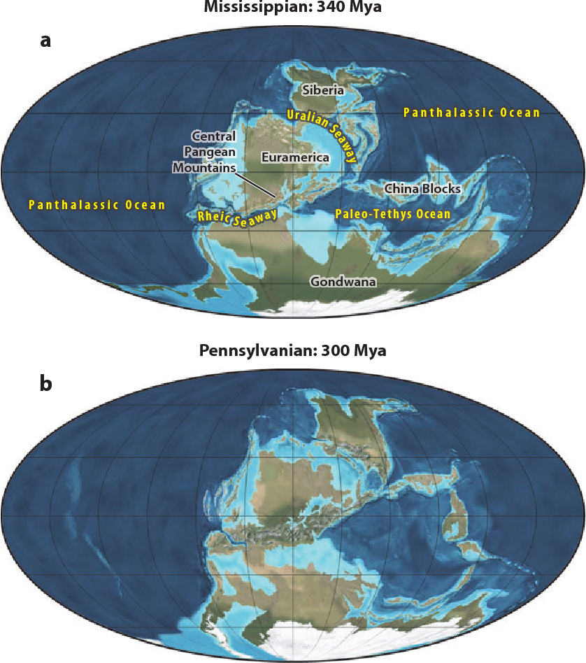
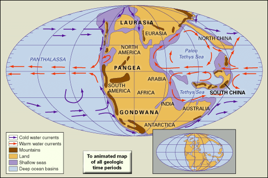
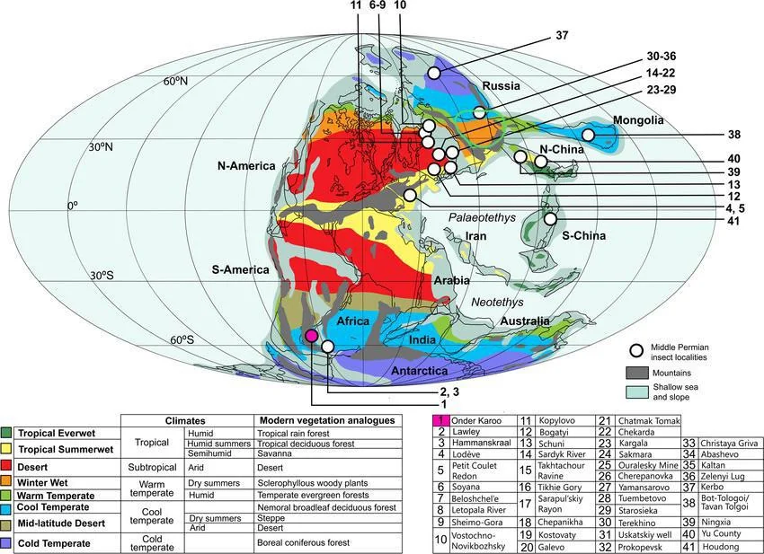
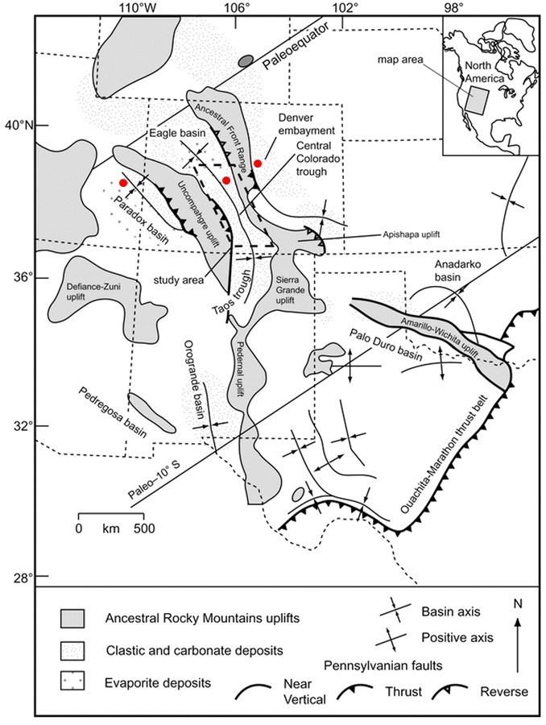

```{r setup, include=FALSE}
knitr::opts_chunk$set(echo = TRUE, warning = FALSE, message = FALSE)
```

# Research Background

I am a first-year PhD student in the Geosciences Dept, working in the GeoPAST group led by Dr. Jeremy Rugenstein. My research is centered around reconstructing deep time terrestrial climate using stable carbon isotopes found in paleosols (fossilized soils), known as pedogenic carbonate. My current project is focused on reconstructing the paleoenvironmental conditions of ancient Colorado during the Paleozoic Era at the end of a time period known as the Carboniferous, roughly 300 million years ago (Ma). This fascinating portion of geologic time was comprised of a number of milestone events in Earth's history, including the inception of the famed supercontinent Pangea, and the Late Paleozoic Ice Age (LPIA) that lasted over 60 million years and resulted in massive, cyclical sea level changes.



At the end of the Carboniferous period, the piece of land that would become Colorado was located near the central west coast of Pangea very near the equator in the paleotropics. Currently, the state is situated roughly 40 degrees North of the equator in the Temperate climate zone. So, it shouldn't come as a surprise that the environment in this region 300 Ma was quite different than what we experience here today. However, the events of the LPIA add an extra layer of complexity when attempting to reconstruct regional paleoclimatic conditions at the end-Carboniferous as there are still many unanswered questions about its spatial and temporal progression across the supercontinent. My study aims to provide some clarity on the interpretation of Colorado's ancient climate using the information provided by stable carbon isotopes found in its Carboniferous paleosols.

{width="427"}

### Using Stable Carbon Isotopes In Paleoclimatology

Carbon is the foundation of life on Earth and can be found in many forms. Most of the carbon found on our planet takes the form of ^12^C (stable, with 6 neutrons), although a small percentage exists as ^13^C (stable, with 7 neutrons), and an even smaller fraction as ^14^C (a radioactive isotope containing 8 neutrons). In the field of paleoclimatology the ratio of ^13^C to ^12^C, known as $\delta$ ^13^C (read "delta 13 C"), can be used as a valuable proxy for environmental characteristics such as mean annual precipitation (MAP), primary productivity, depth of soil carbonate formation, and atmospheric *p*CO~2~. My area of research focuses on the first three qualities as a means to reconstruct paleoclimate.

^12^C is has a lower mass than ^13^C and is thus preferentially taken up by plants during photosynthesis. Based on this relationship, in good conditions when the plants are not stressed by lack of water or sunlight, we expect to see mostly ^12^C in the respired CO~2~ that is released into the soil. However, when plants become stressed due to a lack of resources to perform photosynthesis, they become less picky about which kind of carbon they take in, resulting in more ^13^C being present in the respired CO~2~ found in the soil than "normal." As such, we can use the ratio of these two isotopes of carbon ( $\delta$ ^13^C ) found in fossilized soils, as well as that value's mathematical relationship with characteristics like MAP to interpret what the regional climate was like those millions of years ago.

# Data Compilation

For this project I am comparing a data compilation that I have put together containing roughly 200 data points of $\delta$ ^13^C from other paleosols within various stratigraphic layers across the country with our data (around 50 samples) collected from the Fountain Fm in Northern Colorado representing the same time period. My primary goal is to investigate the spatial variability of this data, as well as the variability of values at a single location. In theory, each location should be generating roughly the same $\delta$ ^13^C since all the individual data points are coming from a small range of stratigraphic layers and geographic locations, but we will see the reality of that in the calculations in the "Statistical Analyses" section below.

```{r}
# Start by installing all necessary packages
source("mapping_setup.R")
```

```{r}
# Read in the data compilation
carb_data_comp <- as_tibble(read.csv("Final Proj 13C Data.csv"))

# Read in our data
carb_data_noco <- as_tibble(read.csv("NoCo d13C Data by Height.csv"))
```

All the following code will be applied to these individual datasets concurrently.

# Paleogeography Map

With the goal of exploring the spatial variability of $\delta$ ^13^C values North America, I will need to start with a map of the world accurate to 300 Ma that includes all of my data points shown as the paleocoordinates at which the soils were formed (*not* the current coordinates at which they were collected). Luckily, a package was developed for this exact purpose!

### Using The rgplates Package

GPlates is a package that has a number of versions made to be compatible with R, Python, and other coding languages. Not surprisingly, the R version of this package is simply called rgplates. You can find more information about the package and its multitude of uses [HERE](https://www.gplates.org/). The primary function that we need from this package is **reconstruct**. Using this function is quite easy. The main thing to keep in mind is that when reconstructing the coordinates and world map, you need to make sure you are using the same reconstruction model for both. As it turns out, the default model does not work very well for my time period of interest, so I needed to manually change the model for the coordinate reconstruction as well. Since this function works with geospatial data, I needed to start by converting the coordinate points of my data compilation to an **sf** format to be compatible with the function inputs. See the process below.

```{r}
# Cleaning the data
comp_data <-  carb_data_comp %>% 
  mutate(across(c('lat', 'long'), round, 1)) %>% 
  select(long, lat, d13C, group_id, sample_id)

noco_data <-  carb_data_noco %>% 
  mutate(across(c('Lat', 'Long'), round, 1)) %>% 
  select(Long, Lat, d13C, group_id, sample_id)
  
noco_data_clean <- noco_data[-c(11, 14, 21, 23, 24), ] %>% 
  slice(1:39)
noco_data_clean$d13C <- as.numeric(noco_data_clean$d13C)
```

```{r}
# Coords need to be vectors for the reconstruct function
lat1 <- as.vector(comp_data$lat)
lon1 <- as.vector(comp_data$long)

lat2 <- as.vector(noco_data_clean$Lat)
lon2 <- as.vector(noco_data_clean$Long)
```

```{r}
# Reconstructing the coordinates to add to our map
paleo_points_1 <- reconstruct(x=cbind(lon1,lat1), age=300, model = "MATTHEWS2016_pmag_ref")
paleo_points_comp <- as_tibble(paleo_points_1)

paleo_points_2 <- reconstruct(x=cbind(lon2,lat2), age=300, model = "MATTHEWS2016_pmag_ref")
paleo_points_noco <- as_tibble(paleo_points_2)


# The reconstruct function spits out a matrix, but we need a dataframe 
points_13C_comp <- cbind(paleo_points_comp, comp_data)

points_13C_noco <- cbind(paleo_points_noco, noco_data_clean)
```

```{r}
# Converting coordinate data to sf format for visualization
paleo_points_comp_sf <- st_as_sf(points_13C_comp, coords = c("paleolong", "paleolat"), crs = 4326)

paleo_points_noco_sf <- st_as_sf(points_13C_noco, coords = c("paleolong", "paleolat"), crs = 4326) 
```

```{r}
# Reconstructing the coastlines for our world map (already in sf format)
coastlines <- reconstruct(x="static_polygons",age=300, model = "MATTHEWS2016_pmag_ref")
```

```{r}
# Making the plot!
ggplot() + 
  geom_sf(data = coastlines, aes()) +
  geom_sf(data = paleo_points_comp_sf, aes(color = d13C), size = 3.5, alpha = 0.8) +
  geom_sf(data = paleo_points_noco_sf, aes(color = d13C, ), shape = 17, size = 3.5, alpha = 0.5) +
  scale_colour_gradientn(colours = c("darkred", "yellow")) +
  theme(legend.key.size = unit(0.3, 'cm')) +
  coord_sf(xlim=c(-75, -30), ylim=c(-10,17)) +
  theme_light() +
  theme(axis.text=element_text(size=12), axis.title=element_text(size=12),
        panel.background = element_rect(fill='skyblue2'))
```

Here we can see that the round points represent data in the compilation, and the triangle-shaped points represent our data. All of these sites (except one to be discussed later) were located near the central west coast of Pangea at 300 Ma. I noticed upon plotting these points that they are clustered into regional groups (where the respective studies in the compilation took place), so it will be simplest to evaluate the spatial variation between the data by groups instead of each of the 250 individual samples.

# Statistical Analyses

To start, I want to see the general spread of $\delta$ ^13^C values between our samples and the data compilation. Looking at the color scale on the plot above it appeared that our data had slightly higher $\delta$ ^13^C than most of the other points in the compilation, and that is confirmed by these histograms.

```{r}
ggplot () +
  geom_histogram(data = comp_data, aes(x = d13C), fill = "slateblue", alpha = 0.8) +
  geom_histogram(data = noco_data_clean, aes(x = d13C), fill = "gold", alpha = 0.8)
```

```{r}
# Loading in a combined dataset for ease of some of the following calculations
stat_data <- as_tibble(read.csv("comp_v_noco.csv"))
```

To get an even better idea of the spread of our data, I want to look at some boxplots of each individual site. Can you guess which one is ours? Yep, that would be the obvious outlier, Group 7. You can see minimal overlap between our lowest values and the highest values of the data compilation, but for the most part Northern Colorado appears to stand on its own. Group 6 is the only group not shown on the map because the few (4) data points it contains are located in the Donets Basin Ukraine which would have required me to zoom out the map so much it would have been difficult to see everything. However, the data from Group 6 appears to align well with that of Groups 1-5.

```{r}
ggplot () +
  geom_boxplot(data = stat_data, aes(x = group_id, y = d13C))
```

The difference between our data and the compilation is further clarified by the differences in the means of each dataset. The higher (more positive) $\delta$ ^13^C values of Colorado indicate a more arid environment in this area than the others represented in the compilation (modern day Texas, New Mexico, Arizona, Illinois, and a few other places).

```{r}
mean(comp_data$d13C)
mean(noco_data_clean$d13C)
```

Next, I want to look into the standard deviation of the data at each site. So, I will start by separating the compilation data into each site which will contain on average a few dozen data points each (except for Groups 3 and 6 which both contain only a few samples.

```{r}
group_1 <- stat_data[stat_data$group_id == 'group1', ]
group_2 <- stat_data[stat_data$group_id == 'group2', ]
group_3 <- stat_data[stat_data$group_id == 'group3', ]
group_4 <- stat_data[stat_data$group_id == 'group4', ]
group_5 <- stat_data[stat_data$group_id == 'group5', ]
group_6 <- stat_data[stat_data$group_id == 'group6', ]
group_7 <- stat_data[stat_data$group_id == 'group7', ]
```

For now, I am going to assume that each group has a normal distribution. In addition to calculating the standard deviation at each site (group), I am interested in the Coefficient of Variation. This value will tell me more about the spread of data at each site by providing further insight into how it varies around the mean. In general, a CV of less than 10% is considered very good and larger than 30% is not acceptable. I wrote a function to calculate this value so I don't have to do it for each individual group.

```{r}
cv_calc <- function(data){
  mean <- mean(data)
  sd <- sd(data)
  cv <- (sd / mean) * 100
  return(cv)
}
```

```{r}
cv_1 <- cv_calc(data = group_1$d13C)
print(cv_1)
cv_2 <- cv_calc(data = group_2$d13C)
print(cv_2)
cv_3 <- cv_calc(data = group_3$d13C)
print(cv_3)
cv_4 <- cv_calc(data = group_4$d13C)
print(cv_4)
cv_5 <- cv_calc(data = group_5$d13C)
print(cv_5)
cv_6 <- cv_calc(data = group_6$d13C)
print(cv_6)
cv_7 <- cv_calc(data = group_7$d13C)
print(cv_7)
```

These results show that our group (Group 7) and about half of the compilation groups have a CV that represents a large spread in the data (near or above 30%). This variation can typically be reduced by omitting outliers. Another factor impacting this value could be the spread of samples throughout stratigraphic columns. There are a few studies within the compilation that contain samples from a handful of consecutive formations, representing perhaps a larger span of time than our Northern Colorado Fountain Fm data. We are still attempting to constrain the absolute age of our samples from the Fountain Fm, and when we do that I will be able to take these analyses a step further to only include compilation data from that more precise timeframe and potentially reduce the variability at each location that way. We are also planning to double our Northern Colorado sample count by doing field work in Manitou Springs next summer, which could potentially reduce the variability within our dataset as well (or not!).

# Discussion

Overall, there are some very interesting questions that need to be answered after exploring this data. Mostly, what caused the distinctly higher $\delta$ ^13^C values in Colorado compared to the rest of the country in the late Paleozoic? Here are a few things to consider in attempting to answer this question...

#### The Late Paleozoic Ice Age (LPIA)

The LPIA lasted for roughly 100 million years from 360-260 Ma, but glaciation was not stable throughout that time and there is still a lot we don't know about where and when ice sheets formed. Though it is thought that most of the ice was located around the south pole at the time frame relevant to this study, it is still possible that smaller regional impacts of glaciation could be felt near the equator in our area of study. So, the LPIA is worth taking into consideration when investigating these tropical environments, at minimum for the purpose of providing a more global context to what we observe in the paleosols.

{width="331"}

#### Ocean/Atmosphere Circulation

As the landmasses of the world were coming together to form the supercontinent Pangea, significant changes in ocean and atmospheric circulation would be expected. The unique patterns of heat and moisture transport associated with this continental arrangement would have dramatically impacted the location and seasonality of terrestrial climate zones and weather events. With a more direct impact on regional climate, this is a major consideration when attempting to reconstruct the paleoenvironmental conditions of modern-day Colorado.



{width="568"}

#### The Ancestral Rockies

Finally, something that hits even closer to home is the uplift of the Ancestral Rocky Mountains that have now been lost to time but whose record remains clear in the Fountain Fm. The Ancestral Rockies were almost a mirror of the modern-day mountain range, running NW-SE through the state. All of the data we currently have comes from the Ancestral Front Range. With our field work next summer we hope to expand that profile southward and also into the Eagle Basin region between this Front Range and the Uncompahgre uplift to the west. Mountains exert a clear impact on local climate, dependent also upon the prevailing wind and moisture patterns present along with them. As such, I would like to emphasize this portion of my research in the future to try and better understand the data we have collected.

{width="343"}
